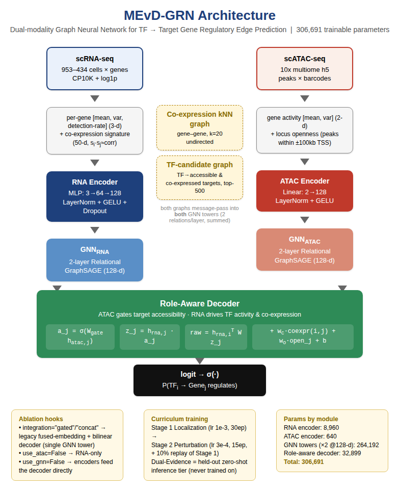

# MEvD-GRN — Weekly Update Slide Content

*15 slides total. Each slide below is one slide in the deck. Where a slide
needs an image or a table, it is marked clearly — a slide with a big image or
a big table still counts as one slide, so the list below is already the
final, reduced slide count (not a "before pasting images" count).*

---

## Slide 1 — Title

GENE REGULATORY NETWORK INFERENCE FROM INTEGRATIVE MULTI-OMICS DATA
By – Vishak Kashyap K, UG4 CND
Advisor – Dr Vinod PK

---

## Slide 2 — Weekly Update banner

[Insert current date range] Weekly Update

---

## Slide 3 — Recap: What We're Trying To Do

- **The goal:** figure out which transcription factors (TFs) switch which genes on or off in a cell — this map is called a Gene Regulatory Network (GRN).
- **The database we use (SC-MO-GRN-DB) is special:** it doesn't give us one plain list of "true" edges. It labels every edge with *how confident* we should be about it.
- **Three confidence levels:**
  - **Localization** (from ChIP-seq): the TF is physically seen sitting near the gene. Lots of these edges, but sitting nearby doesn't always mean it's actually regulating the gene.
  - **Perturbation** (from knockout/CRISPR experiments): when the TF is removed, the gene's expression actually changes. Fewer edges, but this is real functional proof.
  - **Dual-evidence:** edges that have *both* — the smallest set, but the most trustworthy one we have.
- **Our core idea:** instead of throwing all edges into one pile like everyone else does, teach the model using these confidence levels in order, and use the hardest, most trustworthy tier only as a final exam it never studied for.

---

## Slide 4 — What's New Since the Last Update

- **Added a strong new baseline:** implemented and trained *scMultiomeGRN*, a recently published multi-omic GNN (4.08 million parameters), on the exact same K562 data so we can compare fairly.
- **Simplified the training plan:** the model now trains on only two stages — localization, then perturbation. The dual-evidence tier is never trained on; it is used purely as a final, unseen test.
- **Made the data splitting rock-solid:** built a single, global way of splitting edges into train/validation/test so that no edge can ever be "seen" in one tier and "tested" in another, even though the tiers overlap.
- **Ran a full set of experiments (10 variants)** to check which parts of the model and training plan actually matter.
- **Found and measured an honest weakness:** training on perturbation after localization makes the model *forget* what it learned about localization. We measured exactly how bad this is and how much a fix (memory replay) helps.
- **Wrote everything up properly** in a full scientific paper (`paper/main.pdf`) with clear explanations, all the numbers, and next steps.

---

## Slide 5 — Final Model Architecture

- **Big idea:** gene expression (RNA) and DNA accessibility (ATAC) are not the same kind of signal, so we stop mixing them together early. A gene can only be regulated if (a) its DNA region is open/accessible, **and** (b) it is co-expressed with the TF — these are two separate checks, not one blended score.
- **RNA side:** a small neural network turns each gene's expression pattern (mean, variability, how often it's detected, plus a 50-number "co-expression fingerprint") into an embedding.
- **ATAC side:** a similarly small network turns each gene's accessibility pattern into its own embedding.
- **Both sides talk to their gene neighbors** using a graph neural network, so each gene also learns from nearby co-expressed genes and candidate TF targets.
- **The two sides only meet at the very end,** in a "Role-Aware Decoder": the accessibility embedding acts like a gate that decides how much of the RNA signal is allowed through, before the final TF→gene score is computed.
- **Total size: 306,691 parameters** — about 13× smaller than the new scMultiomeGRN baseline (4,077,914 parameters).

---

## Slide 6 — Architecture Diagram

**[PASTE FULL-SLIDE IMAGE HERE: `docs/figures/architecture_diagram.png`]**

(Archival note: this diagram is the pre-2026-09-11 architecture, kept for
historical reference. See `docs/figures/architecture_diagram_v2.png` and the
root `results.md` for the current architecture and results.)

This is the one diagram that shows the whole model end to end: the two
separate RNA/ATAC pipelines, the two shared graphs they both learn from, and
the Role-Aware Decoder where they finally combine.

---

## Slide 7 — Our Data & Why the Evidence Tiers Overlap

- **Cell line used:** K562 (human), the main cell type with all three evidence tiers available.
- **What we have:** 953 cells of RNA data, ~1,126 cells of ATAC data, and a final list of 22,943 genes, 225 of which are TFs.
- **Edge counts after cleanup:** Localization ≈ 1.17M edges, Perturbation ≈ 230K edges, Dual-evidence ≈ 27K edges.
- **The important catch:** these tiers are not separate, independent lists — they overlap heavily. At K562, dual-evidence is 100% contained inside perturbation, and 77.5% contained inside localization.
- **Why this matters:** if we trained the model directly on dual-evidence, we'd mostly be re-teaching it things it already saw in an earlier stage — that wouldn't really test whether it *generalizes*, just whether it *memorizes*. This is exactly why we hold dual-evidence out as a pure test set instead (Slide 8).

**[PASTE IMAGE HERE: `results/figures/fig8_data_overview_nesting.png` — left: size of each tier; right: how much each tier overlaps with the others]**

---

## Slide 8 — New Training Plan: Train on Two Tiers, Test Zero-Shot on the Third

- **Stage 1 — Localization:** the model first learns the broad picture of which TFs can reach which genes (30 training passes).
- **Stage 2 — Perturbation:** the model is then fine-tuned to tell "just binds" apart from "actually regulates" (15 more training passes).
- **Dual-evidence — never trained on:** it is used only once, at the very end, purely to test the model — a true final exam, not something it studied for.
- **A rock-solid splitting rule:** every unique TF–gene pair is assigned to train/validation/test *once*, globally, before being divided up per tier. This guarantees a pair can never be "training data" in one tier and "test data" in another — so the zero-shot test on dual-evidence is genuinely fair.
- **Extra training tricks used:** half of the "negative" examples shown to the model are deliberately tricky ones (pairs that bind but don't regulate), to sharpen the model's judgement.

---

## Slide 9 — An Honest Finding: The Model Forgets What It Learned First

- **The problem:** after Stage 2 (perturbation) training, the model's understanding of Stage 1 (localization) gets overwritten — a well-known issue in machine learning called *catastrophic forgetting*.
- **Our fix attempt — memory replay:** during Stage 2, we keep re-showing the model a small slice (10%) of Stage 1's examples so it doesn't fully forget.
- **The honest result:** replay helps only a little in our main setup — not enough to fully fix the problem on its own. A bigger fix (adding a third "consolidation" stage) recovers much more, and we're planning to test that as the new default.

| Setup | Localization score (AUROC) after Stage 2 |
|---|---|
| No replay | 0.290 (worse than a coin flip) |
| Replay (current default) | 0.326 (still worse than a coin flip) |
| Replay + extra consolidation stage | 0.736 (much better) |

**[PASTE IMAGE HERE: `results/figures/fig5_catastrophic_forgetting_auroc.png` — shows the score dropping from ~0.94 down to 0.326, below the "random guess" line]**

---

## Slide 10 — Main Results: How Our Model Scores on Each Tier

| Tier | AUPR (higher = better) | AUROC (higher = better) |
|---|---|---|
| Localization (trained on, but forgotten) | 0.420 | 0.326 ⚠️ |
| Perturbation (trained on) | 0.575 | 0.876 |
| **Dual-evidence (never trained on — true test)** | **0.558** | **0.838** |

- **The headline result:** on the tier the model *never saw during training*, it still scores AUPR 0.558 and AUROC 0.838 — real evidence that it generalizes, not just memorizes.
- **The honest caveat:** the localization score dropped because of the forgetting issue from Slide 9, not because of any mistake in how we measured it.

---

## Slide 11 — Comparing Against Other Methods

- **New baseline — scMultiomeGRN:** a recently published multi-omic GNN that also uses RNA + ATAC, but trains one *separate* model per tier (no shared learning, so no forgetting) — at 13× our parameter count.
- **Other baselines:** GRNBoost2, RegDiffusion, and a graph-based method (GMF-GAE) — all of these only use RNA, not ATAC.
- **All methods tested on the exact same data splits**, so the comparison is fair.

| Method | Localization AUPR | Perturbation AUPR | Dual-evidence AUPR |
|---|---|---|---|
| **MEvD-GRN (ours)** | 0.420 | **0.575** | **0.558** |
| scMultiomeGRN | **0.831** | 0.423 | 0.384 |
| GRNBoost2 | 0.535 | 0.206 | 0.173 |
| RegDiffusion | 0.546 | 0.185 | 0.165 |
| GMF-GAE | 0.526 | 0.218 | 0.160 |

**[PASTE IMAGE HERE: `results/figures/fig4_full_baseline_comparison.png`]**

- **Reading this fairly:** scMultiomeGRN wins on localization because it never forgets (separate model per tier). We win clearly on perturbation and, most importantly, on the true zero-shot dual-evidence test — using a fraction of the parameters.

---

## Slide 12 — Can We Beat scMultiomeGRN on All Three Tiers?

We already tested two other training recipes for our own model (same 306,691
parameters, just trained differently) to see if they close the remaining gap.

| Setup | Localization | Perturbation | Dual-evidence |
|---|---|---|---|
| scMultiomeGRN (13× our size) | **0.831** | 0.423 | 0.384 |
| Our model — current default | 0.420 | **0.575** | 0.558 |
| Our model — train both tiers together | **0.937** | 0.348 | 0.788 |
| Our model — add the consolidation stage | 0.765 | 0.411 | **0.940** |

- **No single recipe wins all three yet** — but the "add a consolidation stage" version comes closest: it nearly matches scMultiomeGRN on localization and perturbation, while beating it 2.4× on dual-evidence.
- **This is our top priority for next steps** — make this recipe the new default.

**[PASTE IMAGE HERE: `results/figures/fig9_mevdgrn_vs_scmultiomegrn.png`]**

---

## Slide 13 — Ablation Study: What Actually Matters

We tested 10 versions of the model/training setup, each changing one thing at a time, to see what really drives performance.

| What we removed/changed | Dual-evidence AUPR | What it tells us |
|---|---|---|
| Train both tiers together (no strict order) | 0.788 | Beats our sequential plan — sequencing alone isn't the win we expected |
| Add a consolidation stage + replay | **0.940** | Best score overall — the strongest fix for forgetting |
| Remove the graph neural network | 0.241 | Worst score — the graph part is the most important piece |
| Remove ATAC (RNA only) | 0.543 | Barely changes — ATAC isn't adding much *yet*, worth digging into |
| Change the fusion style (gated / concat) | 0.546 / 0.555 | Barely changes — a smaller effect than expected |

**[PASTE IMAGE HERE: `results/figures/fig6_ablation_heatmap.png` — full grid of all 10 setups × all 3 tiers]**

---

## Slide 14 — Limitations & What's Next

- **Current default isn't our best recipe yet:** two other training plans we already tested score higher — adopting one of them is the immediate next step.
- **Only K562 has been fully tested:** we still need to run the same pipeline on ESC (the other cell line with all three evidence tiers) and on cell lines that only have localization data, to see if the model generalizes across cell types.
- **ATAC isn't helping much yet:** we want to check if this is a real biological finding or just because our current accessibility features are too simple.
- **The scMultiomeGRN baseline was trained on a shorter schedule** than its original paper — we plan to re-run it at full length to make sure the comparison stays fair.
- **Next up:** adopt the stronger training recipe as default, run on ESC, run the zero-shot test on other cell lines, and improve the ATAC features.

---

## Slide 15 — Thank You

THANK YOU!
By – Vishak Kashyap K, UG4 CND
