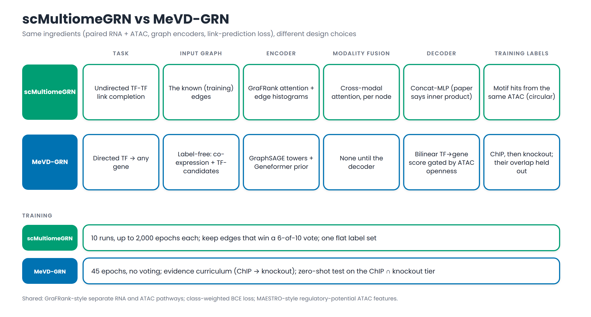
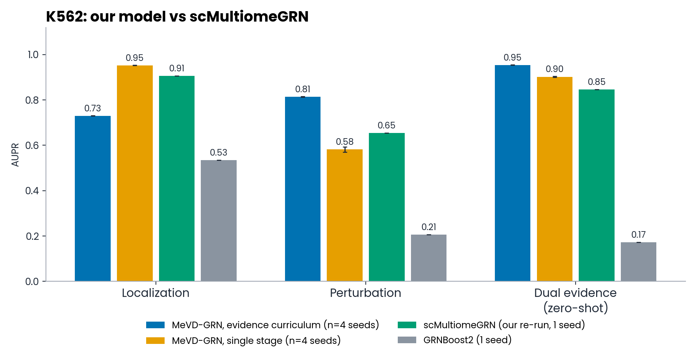

# MeVD-GRN: what we did, 27 Sept to 9 Oct 2026

Advisor meeting, 10 Oct 2026, 11:00. One slide per section; slides are separated by `---`.

**Three parts**
1. Our model against scMultiomeGRN
2. The PBMC experiment, and why we ran it
3. The BEAR-GRN benchmark paper, and what we found

In every result shown, the test data was kept out of training.

---

## Five words you need

| Word | In plain language |
|---|---|
| **TF** (transcription factor) | A protein that switches other genes on or off |
| **GRN** (gene regulatory network) | The list of which TF controls which gene |
| **scRNA-seq** | Measures how active each gene is, cell by cell |
| **scATAC-seq** | Measures which parts of the DNA are open (a TF can only grab open DNA) |
| **ChIP-seq / knockout** | Our "answer keys": ChIP shows where a TF sits on DNA; a knockout removes the TF and sees which genes change |

**Scores:** AUROC and AUPR both measure how well a method ranks true links above false ones. AUROC of 0.5 is a coin flip and 1.0 is perfect. For AUPR, the "random" score is printed next to it.

---

# PART 1. Our model vs scMultiomeGRN

---

## 1.1 What our model does

- Reads RNA and open-DNA data from the **same cells**.
- Builds two gene networks **without using any answers**, and reads them with two small neural networks.
- Scores every TF-gene pair: the chance that the TF controls that gene. Open DNA acts as a gate.
- Learns from ChIP-seq, then knockout. The overlap of the two is kept as a test it never trains on.

---

## 1.2 Our model next to scMultiomeGRN

- **Same ingredients:** RNA + open DNA, graph neural networks, a learn-from-examples loss.
- **Different choices:** what is predicted, what the input network is, where RNA and DNA information meet, and what the answer key is.
- **Their answer key is circular:** scMultiomeGRN learns from DNA-motif hits found in the same open-DNA data it reads. Ours comes from experiments.

---

## 1.3 Which ideas are new?

| Idea | Where it comes from |
|---|---|
| Separate RNA and DNA pathways | **Borrowed** (GraFRank, used by scMultiomeGRN) |
| Open-DNA score; pretrained gene prior (Geneformer) | **Borrowed** (MAESTRO; scRegNet used Geneformer first) |
| Open DNA acts as a gate on the score | Adapted from known biology; no accuracy gain, so we present it as interpretable |
| **Train on ChIP then knockout; test on what both agree on** | **New:** we found no earlier method that does this |

So our contribution is mostly the **training and testing protocol**, not a new network design.

---

## 1.4 K562 results

| Score (AUPR) | Localization (ChIP) | Perturbation | Held-out test |
|---|---|---|---|
| **Ours, step-by-step training** | 0.73 | **0.81** | **0.95** |
| Ours, all at once | **0.95** | 0.58 | 0.90 |
| scMultiomeGRN (our re-run) | 0.91 | 0.65 | 0.85 |

- Step-by-step training **wins 2 of 3** against scMultiomeGRN. It forgets some of what it learned first (the ChIP step).
- Averages of 4 runs; the run-to-run spread is tiny (at most 0.012).

---

## 1.5 Honest caveats

- **scMultiomeGRN here is our own re-write, one run.** We did not run their released code.
- **We did not test on scMultiomeGRN's own dataset** (fetal lung): its answer key is circular, and the data are probably not truly paired.
- The "held-out test" was also used to guide a few design choices, so it is slightly optimistic.
- What scMultiomeGRN does better: richer per-cell features, trained much longer, and it outputs a final network, not just a ranking.

---

# PART 2. The PBMC experiment

---

## 2.1 Why we ran it

- **K562 alone is not enough.** Its data and answer key come from one resource we also trained on. A reviewer will ask: does it work on data we did not pick?
- **PBMC is the most-used test in the field.** A survey of ~130 papers found it used by 17-22 of them, scored the way LINGER scores.
- **It is truly paired** (RNA and open DNA from the same cell) and independent of our training resource.
- **It lets us compare with LINGER**, the strongest published method, on its own test.

---

## 2.2 What the PBMC test is

- **Data:** blood cells from 10x Genomics; 9,543 cells in 4 types (monocytes, CD4 T, B, dendritic).
- **Answer key:** 20 ChIP-seq experiments, 10 different TFs.
- **Score:** for each TF, rank all genes; positives are its top 1,000 ChIP genes. Average the scores.
- **Number to beat:** LINGER's **AUROC 0.714** (a ranking score; 0.5 is a coin flip).

---

## 2.3 How we kept it fair

- Our model **never saw the 10 test TFs** during training.
- Training answers came from a curated database (CollecTRI), not the test answer key.
- Wrong examples were chosen to be hard, so the model cannot win just by learning popular genes.
- 5 repeats of every run; test examples kept out of training; **220 training runs** in total.
- We wrote the winning rule down before seeing results: *beat 0.714 and beat the simple baselines.*

---

## 2.4 PBMC results

| 5 runs | AUROC |
|---|---|
| **Our model** | **0.734** |
| LINGER (published) | 0.714 |
| Our model without open-DNA data | 0.720 |
| Our model without Geneformer | 0.670 |
| Simple baselines (popularity, Pearson) | about 0.58 |

- Open-DNA data helps **a lot without Geneformer** (+0.13) and **barely with it** (+0.015).
- On the other score (AUPR ratio) LINGER is ahead: 2.25 vs 2.14.

---

## 2.5 The win comes from one cell type

- Monocytes hold **10 of the 19 tests**. There we win: **0.76 vs 0.71**.
- In T and B cells we are **slightly below** LINGER.

---

## 2.6 But is the signal really about each TF?

- A ranking that gives **every TF the same genes**, using only "how open is this gene's DNA", scores **0.81**, higher than both methods.
- Using a **different TF's ranking** for a test TF scores almost the same (0.685 vs 0.690).
- So **0.734 vs 0.714 does not prove we find TF-specific regulation**, and the same may hold for LINGER. Checking LINGER needs a re-run we could not finish.

---

# PART 3. The BEAR-GRN paper

---

## 3.1 What BEAR-GRN is

- **A big comparison of 9 GRN methods**, published in *Nature Communications* (18 Sept 2026) by the lab that built our training data.
- Tests on **9 datasets** (K562, macrophages, iPS cells, mouse embryos) against **4 kinds of answer key**.
- Everything is public: data, code, an R package.
- **No other paper cites it yet.**
- We read the abstract, 12 supplementary files, the reviewer replies, and the code. The main text is not online yet.

---

## 3.2 How it scores a method

- **AUROC:** looks only at the links the method chose to output.
- **AUPR:** looks at **all** TF-gene pairs. A pair the method skipped counts as score 0, so **outputting many links is rewarded**.
- **Extras:** top-10,000 links, stability across subsamples, speed and memory, and a test where RNA or DNA data are shuffled to see if they matter.
- Our Python copy of the scoring **matches their published numbers exactly** on everything we checked.

---

## 3.3 What BEAR-GRN found

- **Every method is weak.** No method goes above 0.66 AUROC. On the knockout answer key, **all are at or below random.**
- **LINGER is best overall**, then DIRECT-NET and CellOracle. SCENIC+ is last.
- **LINGER is the most stable but the heaviest:** about 8.5 hours and 89 GB of memory on 5,000 cells.
- **The second data type barely matters:** shuffling RNA or DNA data changes scores by only about 0.02-0.03.
- **The choice of answer key changes the ranking.**

---

## 3.4 Our check: simple tricks match the published methods

- **Output every possible link with no model at all:** this scores **0.431**, level with LINGER's **0.430** on K562.
- **Rank genes by how many TFs already regulate them:** this beats every method on all 9 datasets. It uses ChIP answers from other TFs, so it is a "cheating" reference, not a fair rival.
- So a high score on BEAR-GRN does **not** by itself prove a method found real regulation.

---

## 3.5 Our model on BEAR-GRN

- We tried **4 versions** of our model, set up in advance; the best on validation data was picked: **M3** (adds a "popular target" hint and a DNA-motif match).
- Test: each TF is held out from training (5 groups of TFs), K562, one run.

| K562, BEAR scoring | **Our M3** | LINGER | "Popular-target" reference |
|---|---|---|---|
| ChIP answer key (AUROC / AUPR) | 0.610 / 0.476 | 0.536 / 0.430 | **0.652 / 0.484** |
| ChIP + knockout combined | **0.657 / 0.361** | 0.525 / 0.344 | 0.626 / 0.343 |

- **We beat LINGER**, but on the main ChIP key the simple reference is still ahead.
- On the knockout key our AUPR (0.126) is below random (0.160), as it is for every published method.
- **Not yet done:** 5 runs on all 9 datasets (about 1.5-2 days on the cluster).

---

## 3.6 An important rule: BEAR-GRN is for methods that use no ChIP answers

The authors, in their reply to reviewers:

> "BEAR-GRN targets settings where cell-type-specific ChIP-seq labels are unavailable."
> Fairly evaluating supervised approaches "would require a dedicated design (e.g., leave-one-TF-out cross-validation …), which we leave for future work."

- **Our model learns from ChIP answers, so it is outside what BEAR-GRN is built for.**
- Holding out the test TFs is the design they suggest, but we train on the same cell type's ChIP for other TFs.
- **Safe wording:** "under the leave-one-TF-out design suggested by the BEAR-GRN authors", not "we beat LINGER on BEAR-GRN".
- Not checked: the final text of the paper.

---

# Where we go from here

---

## 4.1 What we can and cannot say

**We can say**
1. We built a fair, repeatable test setup: test TFs and test examples never enter training.
2. In that setup, step-by-step training beats our re-run of scMultiomeGRN on 2 of 3 K562 tests.
3. On two benchmarks (PBMC and BEAR-GRN), **simple tricks score as high as published methods**.

**We cannot say yet**
- That we find TF-specific regulation on PBMC.
- That we beat LINGER on BEAR-GRN under its own rules.
- Anything about scMultiomeGRN's own dataset.

---

## 4.2 Proposed next step: a model with no answer key

**The idea, in biology terms:** in every cell, a TF's activity goes up and down. If a gene follows one TF's ups and downs, **and that gene's DNA is open in that cell**, the TF probably controls it.

- **Train the model to predict each gene's activity in each cell** from the TFs' activity, with open DNA as a gate. The learned links are the network. **No ChIP or knockout needed.**
- **Why this should find real regulation:** a simple "popular gene" shortcut cannot explain why a gene differs **between cells**. The model has to use the TFs.
- **Start with easy clues** (a TF motif in open DNA), then stronger ones (DNA that opens together with the gene), then activity that follows the TF.
- **Pretrain on larger datasets** (blood, bone marrow), since K562 has only 411 cells.
- **Test on BEAR-GRN**, with the simple tricks and the "different TF" check as controls.

---

## 4.3 Timeline

| When | What |
|---|---|
| Done | 4 versions of our model tested on K562; M3 chosen |
| Now | A detailed plan from a planning agent (`docs/selfsup_plan/plan.md`) |
| Oct 10-24 | Simple no-answer baselines on all 9 BEAR datasets; design the new model |
| Oct 24 - Nov 21 | Build and tune the new model on K562 and one macrophage set only |
| **Nov 7** | **Decision:** if it shows real TF-specific signal, continue; if not, write an audit-style paper for PLOS ONE |
| Nov 21 - Dec 12 | Freeze; 5 runs on all 9 datasets |
| Dec 12 - Jan 15 | Writing (ICML 2027 mid-January; PLOS ONE before February) |

---

## 4.4 Questions for you

1. **Scope:** report BEAR-GRN numbers only in the leave-one-TF-out setting (as a reference), and build the no-answer-key model for the real claim?
2. **Venue:** ICML 2027 needs a new idea; PLOS ONE rewards careful work and fits what we already have. Which first?
3. **scMultiomeGRN's own dataset:** run it for a head-to-head or skip it?
4. **If we keep the supervised model:** step-by-step training (wins 2 tests) or all at once (wins one)?

---

## Appendix. Where things are

- Code and results are in the project repository. Deck: `docs/presentation/presentation.md`; plots: `make_plots.py`; diagrams: `docs/figures/`.
- Details: `docs/experiments/` (K562 reruns, PBMC, BEAR-GRN) and `docs/mevd_vs_scmultiomegrn.md`.
- Figures are drawn locally (the BioRender connector is not available).
