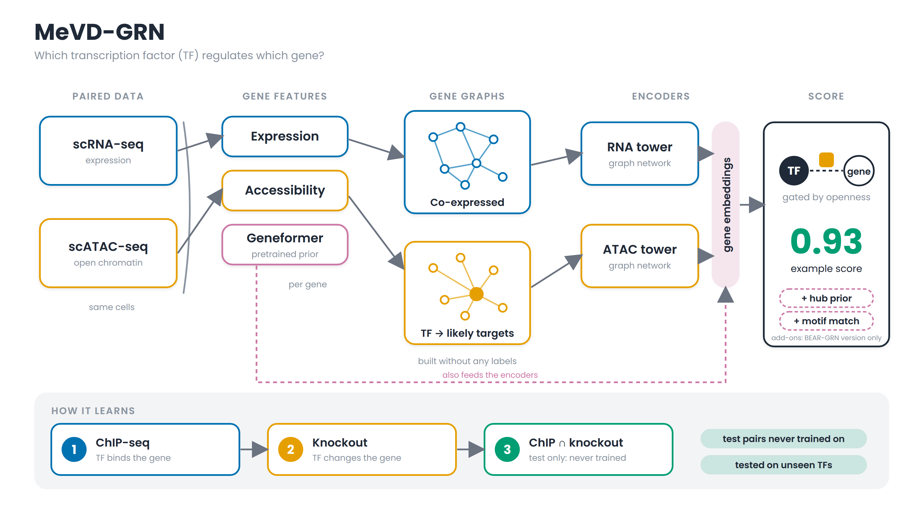
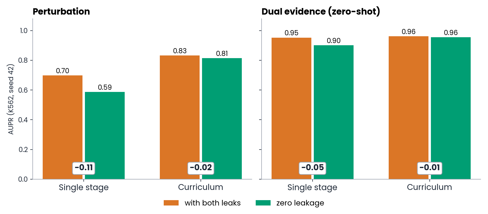
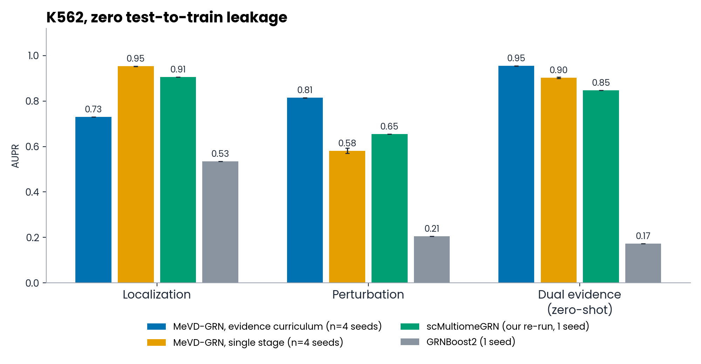
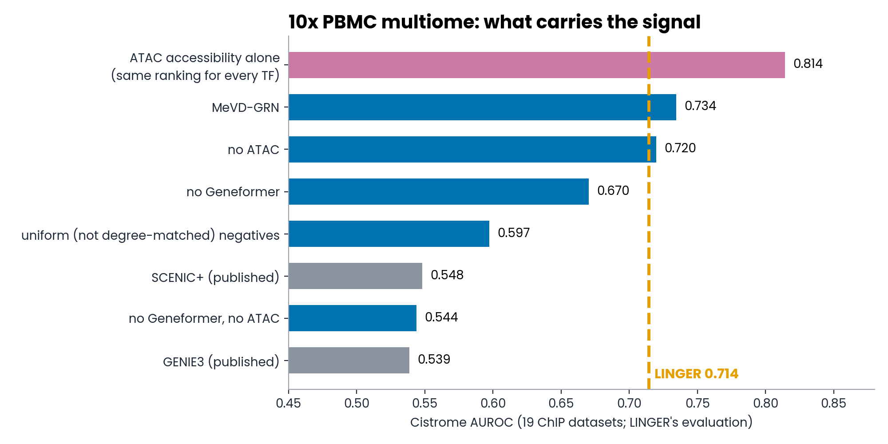
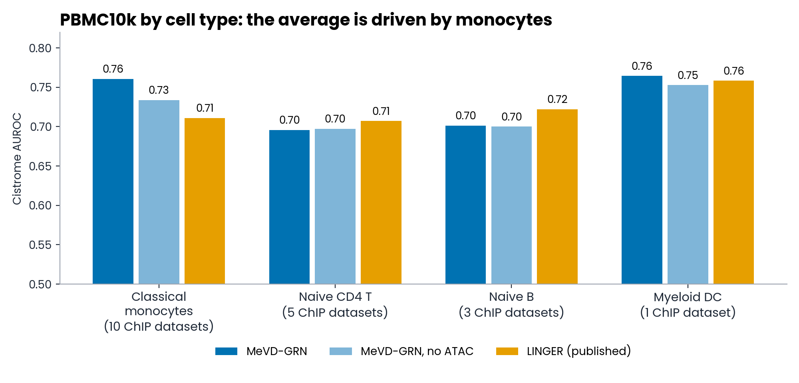
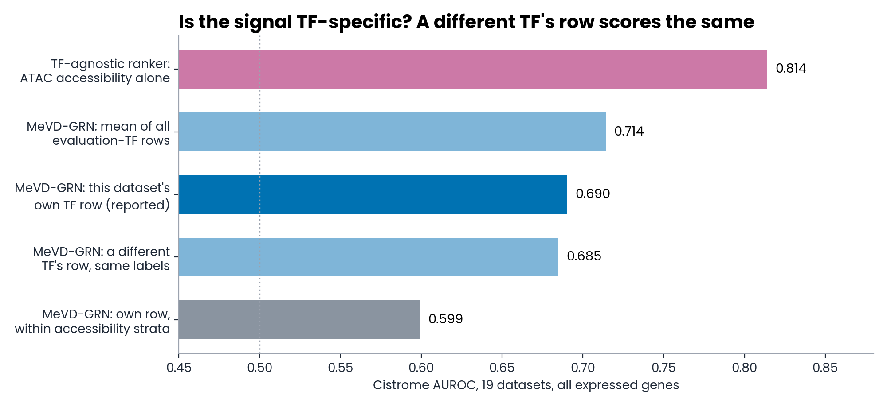
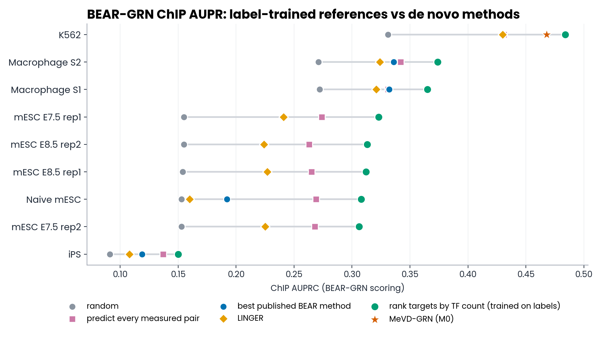

# MeVD-GRN: progress, 27 Sept to 9 Oct 2026

Advisor meeting, 10 Oct 2026, 11:00. Slides are separated by `---`.
Figures are in `figs/` (regenerate with `python make_plots.py`; every number is read from the result files).
Everything shown is **zero test-to-train leakage** unless a row says "with leaks".

---

## 1. The question

**Which transcription factor (TF) regulates which gene?** Predict TF → gene links from paired single-cell RNA + ATAC.

- Two graph encoders (RNA tower, ATAC tower) over label-free gene graphs, plus a pretrained Geneformer prior.
- A gated score for each TF-gene pair: chromatin openness acts as a gate.
- Trained on ChIP-seq, then knockout evidence; the intersection tier is held out as a zero-shot test.

---

## 2. What happened in two weeks

| Date | What |
|---|---|
| 29-30 Sep | Docs reorganised; 17 local papers turned into a knowledge base |
| 30 Sep | **Train/test leak #1 found and fixed** (negative sampling) |
| 1 Oct | ~130-paper survey picks the benchmark; Ada cluster upgraded; PBMC10k pipeline + 220 runs; leak re-run on K562 |
| 2 Oct | PBMC10k grid complete; BEAR-GRN (Nat Commun, Sept 2026) built in as our SC-MO-GRN-DB baseline |
| 8 Oct | BEAR-GRN becomes the only benchmark; Ada login blocked (expired password); **leak #2 fixed** (label-dependent graphs); zero-leak guard added |
| 9 Oct | BEAR-GRN pipeline running; baselines scored on 9 datasets; **first MeVD-GRN BEAR result** |

---

## 3. Two leaks, both closed

| | Single stage | Curriculum |
|---|---|---|
| Perturbation AUPR, with leaks to zero leakage | 0.70 to 0.59 | 0.83 to 0.81 |
| Dual-evidence AUPR, with leaks to zero leakage | 0.95 to 0.90 | 0.96 to 0.96 |

- **Leak #1:** the trainer drew negatives from a pool that also held the validation and test negatives.
- **Leak #2:** input graphs were built with held-out positives excluded, so a pair's absence from the graph hinted at its label.
- Now enforced in code: training **refuses to run** unless both are closed, and every result file records it.
- Re-running with the leak switched back on reproduces the old paper numbers exactly, so the drops come from the fixes alone.

---

## 4. K562 (SC-MO-GRN-DB): zero leakage, same splits for every model

AUPR / AUROC, mean over 4 seeds (std ≤ 0.012):

| Model | Localization | Perturbation | Dual evidence (zero-shot) |
|---|---|---|---|
| **MeVD-GRN, evidence curriculum** | 0.730 / 0.751 | **0.814 / 0.960** | **0.954 / 0.990** |
| MeVD-GRN, single stage | **0.953 / 0.947** | 0.582 / 0.883 | 0.902 / 0.979 |
| scMultiomeGRN (our re-run, 1 seed) | 0.906 / 0.914 | 0.655 / 0.919 | 0.847 / 0.971 |
| GRNBoost2 | 0.535 / 0.499 | 0.206 / 0.550 | 0.173 / 0.525 |

- The curriculum wins perturbation (+0.16 AUPR) and the zero-shot tier (+0.11) against scMultiomeGRN, and loses localization (it forgets the first tier).
- Caveat: the scMultiomeGRN row is our re-implementation, one seed. This is not its own benchmark.

---

## 5. Choosing an external benchmark

- **Survey of ~130 papers** (journals, ML venues, preprints, benchmarks): the most-used paired dataset is the 10x PBMC multiome (17-22 papers), scored against Cistrome ChIP-seq as in LINGER (Nat Biotechnol 2024).
- Reviewers now expect **TF-held-out splits, degree-matched negatives and trivial baselines**; random edge splits let simple tricks match GNNs.
- Then **BEAR-GRN** (Nat Commun, 18 Sept 2026) appeared: 9 datasets, 4 ground truths, 9 methods; LINGER ranks first overall.

---

## 6a. PBMC10k multiome vs LINGER: the task and the bar

**What we ran:** MeVD-GRN on the 10x Genomics *PBMC granulocyte-sorted 10k Multiome* (RNA and ATAC from the same nuclei), scored with LINGER's own evaluation code. 220 training runs on Ada.

| | |
|---|---|
| **Data** | 11,898 barcodes; LINGER's 9,543 labelled cells in 4 cell types: classical monocytes 1,848, naive CD4 T 1,373, naive B 282, myeloid DC 232 |
| **Why this dataset** | the most-used paired dataset in the literature (17-22 papers: SCENIC+, LINGER, scGLUE, KEGNI, scTFBridge) |
| **Ground truth** | 20 Cistrome ChIP-seq datasets = 10 TFs (MYC, RUNX1, IRF4, STAT1, IRF1, ETS1, FOXP3, CTCF, REST, SPI1) x 4 cell types |
| **Metric** | positives = a TF's top-1,000 genes by ChIP regulatory potential; score its gene ranking with AUROC and AUPR ratio; mean over the 19 evaluable datasets |
| **The bar** | LINGER (Nat Biotechnol 2024): **AUROC 0.7143, AUPR ratio 2.2526**. SCENIC+ 0.548 / 1.29, GENIE3 0.539 / 1.17 |

LINGER is unsupervised (no TF-target labels); MeVD-GRN is supervised, so the protocol must keep the test TFs away from training.

---

## 6b. PBMC10k: the fair protocol (fixed before any result existed)

- **Training labels:** CollecTRI (literature-curated); DoRothEA A-B as a second source. **All 10 evaluation TFs are removed as regulators**, so a test TF is never seen in training.
- **Negatives:** degree-matched (a negative keeps its TF and picks a target in proportion to how often targets are regulated), so a model cannot win just by learning popular targets.
- **Inputs:** gene graphs built without labels; motif relation off; early stopping on validation AUPR only; 5 seeds; one model per cell type; the zero-leak guard on every run.
- **Variants:** full model (Geneformer + 384-d); no ATAC; no Geneformer; neither; uniform negatives; DoRothEA labels; random-edge and held-out-target splits.
- **Baselines scored by the same code:** target-count ranker, gene-ID logistic regression, Pearson correlation. LINGER's published numbers are used because our own LINGER re-run failed (it needs ~120 GB of memory and a missing package).
- **Pre-registered win rule:** mean AUROC above LINGER's 0.714 *and* above the simple baselines. *(This turned out to be too weak: see 6d.)*

---

## 6c. PBMC10k: results

| 5 seeds, TFs held out | AUROC | AUPR ratio |
|---|---|---|
| **MeVD-GRN** | **0.734 ± 0.005** | 2.135 |
| LINGER (published) | 0.714 | **2.253** |
| MeVD-GRN, no ATAC | 0.720 ± 0.030 | 2.178 |
| MeVD-GRN, no Geneformer | 0.670 ± 0.008 | 1.722 |
| MeVD-GRN, neither | 0.544 ± 0.011 | 1.337 |
| MeVD-GRN, uniform negatives | 0.597 ± 0.014 | 1.698 |
| MeVD-GRN, DoRothEA labels | 0.658 ± 0.018 | 1.933 |
| Target count / gene ID / Pearson | 0.579 / 0.578 / 0.584 | 1.4-1.6 |

- ATAC adds **+0.126** AUROC when Geneformer is absent, but only **+0.015** (within noise) when it is present.
- Degree-matched negatives are essential (0.734 vs 0.597); CollecTRI beats DoRothEA.

- **The average win comes from monocytes** (10 of the 19 datasets): 0.760 vs LINGER's 0.711. On naive CD4 T and naive B, MeVD-GRN is below LINGER (0.696 vs 0.707; 0.701 vs 0.722).

---

## 6d. PBMC10k: is the signal TF-specific? (no)

- A ranker that gives **every TF the same gene ranking**, using ATAC accessibility alone, scores **0.814**, above MeVD-GRN and LINGER. The Cistrome metric rewards open chromatin.
- **A dataset's own TF row scores no better than a different TF's row** against that dataset's labels (0.690 vs 0.685, seed-42 local models). The model's score is almost entirely a TF-agnostic per-gene ranking; within accessibility strata it falls to 0.599.
- So **"0.734 vs 0.714" is not evidence of TF-specific regulation**, for either method. LINGER's own rows have not been checked: that needs the LINGER re-run.
- **Held-out target genes:** the original split scored 0.409 (below random) because its negative design taught a per-target prior; the fixed `target_all` split scores 0.745.
- **Open:** a local rerun of the headline gives 0.690, not 0.734 (cause not found); results are on all expressed genes, not LINGER's own candidate genes.

---

## 7. BEAR-GRN: what we found

- Scoring port reproduces BEAR's published AUPRC exactly on the methods we checked.
- **On all 9 datasets, a baseline that ranks genes by how many TFs regulate them beats every published method**, LINGER included.
- Predicting every measured pair gets within 0.001 of LINGER on K562.
- On knockout and intersection ground truths every method is at or below random.
- **First MeVD-GRN result (K562, model M0, one seed, 5 TF-held-out folds):**

| K562 | MeVD-GRN M0 | LINGER | Target-count baseline |
|---|---|---|---|
| ChIP AUROC / AUPRC | 0.602 / 0.468 | 0.536 / 0.430 | 0.652 / 0.484 |
| Union AUROC / AUPRC | 0.635 / 0.347 | 0.525 / 0.344 | 0.626 / 0.343 |

---

## 8. A scope problem we must state

BEAR-GRN's authors **exclude supervised methods** (reply to reviewers, peer-review file):

> "BEAR-GRN targets settings where cell-type-specific ChIP-seq labels are unavailable."
> "Fairly evaluating these supervised approaches would require a dedicated design (e.g., leave-one-TF-out cross-validation using multi-cell-type ChIP-seq compendia), which we leave for future work."

- MeVD-GRN is trained on labels, so **it is outside BEAR's stated scope**. So is the target-count baseline (it learns from other TFs' ChIP).
- Our TF-held-out protocol is the design they name, but our main regime (L1) trains on the **same cell type's** ChIP for other TFs.
- The regime in scope is **L2**: train on the non-specific compendium only, with every evaluated TF removed. It is planned but not yet run.
- Honest wording for any claim: *"under the leave-TF-out design BEAR's authors propose"*, not *"we beat LINGER on BEAR"*.
- Not verified: the final Methods text (the paper is an accelerated preview with no body online).

---

## 9. What we can and cannot claim

**Supported**
1. Two leaks found and closed, enforced in code.
2. With zero leakage, the evidence curriculum beats scMultiomeGRN (our re-run) on perturbation and the zero-shot tier on K562.
3. Benchmark audit: trivial per-gene rankers match or beat published methods on both PBMC10k (ATAC accessibility alone: 0.814) and BEAR-GRN (target count).

**Not yet supported**
- MeVD-GRN beating LINGER on BEAR-GRN in the in-scope (L2) regime.
- A PBMC10k win that reflects TF-specific signal (a different TF's row scores the same; see 6d).
- Anything on scMultiomeGRN's own benchmark (not run, by decision).

---

## 10. Status and timeline

| Job | Status | ETA |
|---|---|---|
| BEAR-GRN model M0 (K562; laptop) | done, 70 min | done |
| M1 uniform negatives (laptop) | done, 67 min | done |
| M2 hub term (**Ada**, 1 GPU) | running | ~23:30 |
| M3 hub + motif features (**Ada**, 1 GPU) | running | ~23:30 |
| Model selection (K562 validation only) | after M2 and M3 | ~23:40 |
| K562 seed 46, PBMC held-out-target seeds (laptop) | running now | overnight |
| **BEAR headline grid** (5 seeds x 9 datasets, L2 regime, 3 ablations; ~150 runs) | not started | **4-6 days laptop; ~1.5-2 days on Ada's 4 GPUs** |

Ada ETAs assume ~70-90 min per candidate on a 2080 Ti (not yet measured). Ada needs campus network or VPN. M0 and M1 so far: M1 (uniform negatives) leads M0 on validation, 0.545 vs 0.526 mean inner-validation AUPR.

---

## 11. Decisions for the advisor

1. **Scope:** report BEAR-GRN results only in the leave-TF-out framing, with L2 as the in-scope headline. Agree?
2. **Self-supervised track:** pretrain without any ChIP labels (masked gene reconstruction) and score the learned similarities. Fully in scope, but a redesign and days of work. Worth it?
3. **Headline model:** curriculum (wins perturbation and zero-shot) vs single stage (wins localization).
4. **Paper story:** lead with K562 zero-leak + the benchmark audit, with BEAR/PBMC as supporting evidence.

---

## Appendix A. Reproducibility

- Branch `leak-fix-and-benchmarks`; key commits: `c26c03d` (leak #1), `d854fb6` (zero-leak guard), `8ed78ea` (BEAR pipeline), `0a46cf3` (selection tools).
- Runbooks: `docs/experiments/` (`leakfix_rerun.md`, `labelfree_graph_rerun.md`, `pbmc10k_linger_benchmark.md`, `bear_grn_benchmark.md`).
- Plots: `docs/presentation/make_plots.py`. Diagram: `docs/figures/make_architecture_simple.py`.

## Appendix B. BioRender figure prompts (connector needs re-authorization)

1. *Left-to-right schematic: paired cell with scRNA-seq (blue) and scATAC-seq (orange) tracks; two label-free gene graphs (co-expression, TF-to-targets star); RNA and ATAC graph towers with a purple Geneformer prior; a gated TF-gene score. Flat, colorblind-safe, short labels.*
2. *Two panels, "with leaks" and "zero leakage": a pool of negative TF-gene pairs split into train, validation and test; left shows training on the whole pool (warning icon), right shows test negatives removed and test TFs held out (check icon).*
3. *Scope diagram: BEAR-GRN's de novo methods (no labels) vs supervised methods (ChIP labels), with a leave-one-TF-out design as the bridge.*
