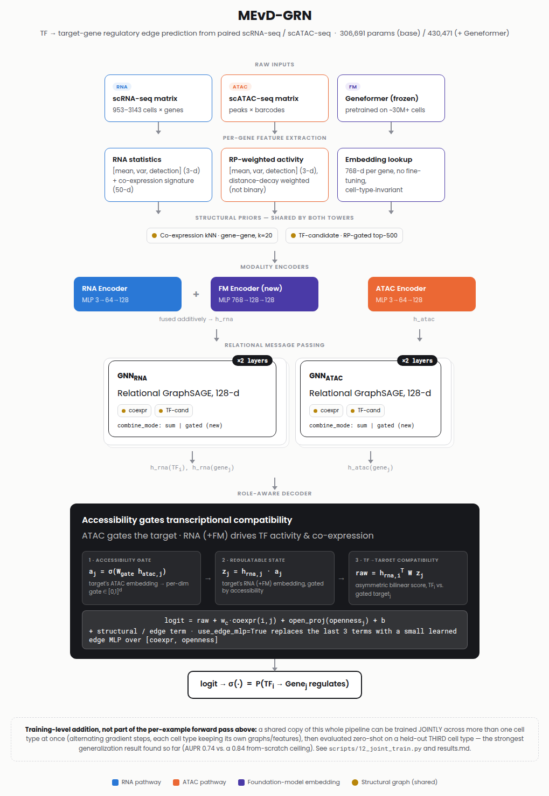

# Gene Regulatory Network Inference from Integrative Multi-Omics Data
**Weekly Update — 6th Sept '26 – 12th Sept '26**
By Vishak Kashyap K, UG4 CND · Advisor: Dr Vinod PK

---

## Where we left off

Last update, the model's results looked mediocre and inconsistent across
evidence tiers, and the working hypothesis was **data leakage** somewhere in
the pipeline. This week was spent (1) actually finding out what was wrong,
(2) fixing it, and (3) — once the real numbers came back much stronger than
expected — using the extra confidence and Ada cluster access to add four
substantial new pieces to the architecture. Short version: **it wasn't
leakage**. It was two specific, fixable bugs, and fixing them plus adding a
pretrained gene embedding took the model's headline zero-shot score from
**0.558 → 0.951 AUPR**.

---

## Part 1 — The investigation: it wasn't leakage

Three things were checked in parallel: the train/val/test splitting logic,
whether labels could leak into the graph the model message-passes over, and
whether the training loop itself was internally consistent.

**Result: no classical data leakage found.** The global pair-level split
(every TF–gene pair assigned to exactly one split, once, across all evidence
tiers) is correct. The graph used for message passing correctly excludes
every known positive edge, so validation/test labels cannot leak into node
embeddings. What we found instead were two specific, real bugs:

| # | Bug | Symptom it caused |
|---|---|---|
| 1 | **EPR metric miscomputed.** Early precision was ranked over a small curated eval set but normalized against the genome-wide TF×gene candidate count. | EPR values inflated into the hundreds (up to ~450) — looked alarming, meant nothing. |
| 2 | **Hard-negative mining leaked across splits.** During Stage 2 training, "hard negative" candidates were drawn from a lower tier's *entire* evidence (train **and** val/test), not just its train split — so the model was actively trained to score down the exact edges later used to score it on that tier. | Localization AUROC fell **below random (0.33)** after Stage 2 — not ordinary forgetting, active mis-training. |

**Key Takeaway:** Bug #2 was the dominant cause of "bad results." Fixing it
alone — restricting hard negatives to a tier's own train split — took
localization AUROC from 0.33 (worse than a coin flip) to 0.51 (mild, expected
forgetting), and zero-shot dual-evidence AUPR from **0.558 → 0.870**.

**Critical Context:** this is a good reminder that "the numbers look
suspicious" does not automatically mean "leakage" — it can just as easily be
a metric bug or a subtler training-time label contamination that has nothing
to do with the classic train/test split story.

---

## Part 2 — Architecture: old vs. new

*Figure: current architecture (2026-09-12). Compare against
`docs/figures/architecture_diagram.png` for the original, pre-this-week
version.*

**What stayed the same:** the core idea — two separate encoder/GNN towers
(RNA and ATAC) that only combine at a role-aware decoder, where chromatin
accessibility *gates* transcriptional compatibility rather than being mixed
in as an equal feature — is unchanged. So is the underlying evidence-tier
curriculum (localization → perturbation → dual-evidence held out zero-shot).

**What's new this week**, each described in its own section below:

| Component | Old | New |
|---|---|---|
| ATAC gene-activity score | binary ±100kb window, every peak counts the same | distance-weighted regulatory potential (closer peaks count more) |
| ATAC locus descriptor | 1 collapsed, heavily-quantized "openness" scalar | 4-number locus-shape descriptor (mean/max RP, distance, peak count) |
| ATAC encoder | single linear layer | proper 2-layer MLP |
| Relation combination | always sum co-expression + TF-candidate graphs equally | optional **learned** per-layer weight (`combine_mode: gated`) |
| Extra input | none | optional **pretrained Geneformer gene embedding** (768-d, frozen) |
| Third graph relation | none | **real TF motif graph** (in progress, not finished yet — see Part 6) |
| Training scope | one cell type only | can now train **jointly across multiple cell types** |

---

## Part 3 — Headline results: old vs. new

All numbers below are K562, same evaluation protocol (zero-shot on
dual-evidence = never trained on).

| Version | Loc AUPR | Pert AUPR | **Dual AUPR (zero-shot)** | Dual AUROC |
|---|---:|---:|---:|---:|
| Last week (pre-bugfix) | 0.420 | 0.575 | 0.558 | 0.838 |
| This week, bugs fixed | 0.573 | 0.641 | **0.881** | 0.971 |
| This week, + Geneformer embedding | 0.677 | 0.800 | **0.951** | 0.989 |

**Key Takeaway:** fixing the two bugs alone was already a +0.32 AUPR jump.
Adding the pretrained embedding on top was an even bigger single jump
(+0.07 AUPR) than the bugfixes' architecture-relevant component — **the
single largest improvement found this week, or arguably in the whole
project so far.**

**Critical Context:** the model does *not* actually need its own hand-built
RNA co-expression features anymore once the embedding is present — an
`fm_only` ablation (embedding alone, hand-built RNA features zeroed) scores
**0.951 AUPR**, matching or slightly beating the combined version (0.949).
That is a real, slightly uncomfortable finding: a big chunk of this
project's original RNA-featurization design work is now redundant. See Part
5 for why this isn't quite as simple as "always use the embedding," though.

---

## Part 4 — Baselines: old vs. new

| Method | Loc AUPR | Pert AUPR | Dual AUPR | Dual AUROC | Note |
|---|---:|---:|---:|---:|---|
| **MEvD-GRN (fixed, no embedding)** | 0.573 | 0.641 | **0.881** | 0.971 | |
| **MEvD-GRN + Geneformer** | 0.677 | 0.800 | **0.951** | 0.989 | |
| scMultiomeGRN (adapted baseline) | 0.906 | 0.655 | 0.847 | 0.971 | see note below |
| GRNBoost2 | 0.535 | 0.206 | 0.173 | 0.525 | unaffected by this week's fixes |
| RegDiffusion | 0.546 | 0.185 | 0.165 | 0.490 | unaffected by this week's fixes |
| GMF-GAE | 0.526 | 0.218 | 0.160 | 0.516 | unaffected by this week's fixes |

**scMultiomeGRN note:** the full localization→perturbation curriculum has
since completed (4-GPU data-parallel run, 2000 epochs per tier, ~6h total —
see `results.md` Section 7 for the full writeup) and dual-evidence is now
scored zero-shot from the perturbation-tier model, same convention as
MEvD-GRN's own headline claim. It beats MEvD-GRN's base (no-embedding) model
on localization (0.906 vs 0.573) and perturbation (0.655 vs 0.641) — plausible
since scMultiomeGRN trains a dedicated model per tier with no forgetting
between stages, while MEvD-GRN's sequential curriculum deliberately keeps a
single model across both. MEvD-GRN still wins the tier that matters most for
this project's headline claim, zero-shot dual-evidence (0.881/0.971 vs
0.847/0.971) — AUROC ties, AUPR favors MEvD-GRN.

**Key Takeaway:** all three RNA-only baselines (GRNBoost2, RegDiffusion,
GMF-GAE) cluster near random on perturbation/dual (AUPR 0.16–0.22) — MEvD-GRN's
multi-omic graph structure clearly matters relative to expression-only methods.

---

## Part 5 — What actually helped (ablations, current pipeline)

| Ablation | Change | Dual AUPR | Dual AUROC |
|---|---|---:|---:|
| **Full model** | (reference) | **0.881** | **0.971** |
| `no_gnn` | remove GNN message passing entirely | 0.295 | 0.720 |
| `coexpr_only` | GNN sees only the co-expression graph | 0.814 | 0.953 |
| `tf_cand_only` | GNN sees only the TF-candidate graph | 0.785 | 0.933 |
| `rna_only` | ATAC features zeroed | 0.856 | 0.962 |
| `gated_fusion` / `concat_fusion` / `edge_mlp` | alternative fusion styles | 0.882–0.890 | 0.970–0.971 |
| `gated_relations` | learned relation weight instead of fixed sum | 0.876 | 0.969 |
| `pert_only` | skip localization pretraining entirely | 0.441 | 0.757 |
| `fm_only`* | Geneformer embedding alone, hand-built RNA zeroed | **0.951** | **0.989** |

*`fm_only` is not a peer of the other rows — every other row (including
"Full model") is a variant of the **pre-Geneformer** architecture, used to
isolate what each hand-built piece (GNN, graphs, fusion style) contributes
on its own. `fm_only` is here only to show a striking, slightly humbling
result: a frozen, off-the-shelf gene embedding used ALONE beats our entire
hand-engineered pipeline (0.951 vs. 0.881). It is not "the best model" —
see Part 6 / `results.md` Section 5 for `with_fm` (hand-built features +
Geneformer combined, ~0.949-0.963 depending on model size), which is the
actual best-of-everything result.

**Key Takeaway, GNN necessity:** removing message passing entirely is still
by far the most damaging change (0.881 → 0.295) — this has been true since
before this week and remains the single most load-bearing architectural
decision.

**Key Takeaway, ATAC fix worked:** before this week, `tf_cand_only` scored
close to `no_gnn` (~0.26) because its accessibility gate passed ~90% of
genes and barely filtered anything. After the distance-weighted rewrite,
`tf_cand_only` (0.785) is close to `coexpr_only` (0.814) — **both individual
graphs now carry real, comparable signal**, and `rna_only` (0.856) is now
clearly, measurably below the full model, where before there was almost no
gap at all.

**Critical Context:** fusion style (role-aware vs. gated vs. concat vs.
edge-MLP) is a genuine second-order effect — all four sit within 0.01 AUPR
of each other. The role-aware design is motivated by biological
interpretability, not by a raw accuracy advantage. The learned relation
combiner (`gated_relations`) is similarly neutral right now (0.876 vs.
0.881) — expected, since it only has two already-comparable-strength
relations to weigh between; it should become more interesting once the real
motif graph (Part 6) gives it a third, genuinely different relation.

---

## Part 6 — New component: real TF motif scanning (IN PROGRESS, NOT DONE)

**What this is:** replacing the TF-candidate graph's current accessibility-only
heuristic ("is this gene's locus open") with an actual DNA sequence scan
("does this specific TF's known binding motif appear in this specific
accessible peak"). This is exactly what the scMultiomeGRN paper does with
FIMO for its own model — MEvD-GRN never did the equivalent for itself until
this week.

**Status: code complete, data still downloading.**
- ✅ New module (`src/data/motif_scan.py`): parses JASPAR motif files, builds
  log-odds PWM scores, scans peak sequences, builds the graph.
- ✅ Validated on real data: JASPAR file has 816 TF motifs, 119 of K562's 225
  TFs are covered; scanning math checked against synthetic sequences (a
  consensus sequence scores 100% of max, random sequence scores ~19%).
- ✅ Fully wired through the model as an optional 3rd relation (`use_motif`
  flag) — the GNN, the gated combiner, and a new `motif_graph_only` ablation
  all already support it.
- ⏳ **Blocked on downloading the human genome sequence (hg38, ~1GB
  compressed)** — the download has been interrupted by connection drops
  twice and is currently re-running with resume support. Not yet run against
  real K562 data.

**Not done this week; next up once the download finishes.**

---

## Part 7 — New component: pretrained foundation-model embeddings

**What this is:** Geneformer, a transformer model pretrained on tens of
millions of real single cells, ships a lookup table of one 768-number vector
per gene. We use it as-is (no fine-tuning) as an extra input, added directly
into the RNA pathway.

**Result: the single biggest win this week** (Part 3) — zero-shot dual AUPR
0.881 → 0.951. Coverage: 77% of K562's genes, 90% of Macrophage's and MCF7's.

**A genuine surprise, though:** this same embedding, when the model is
trained on only ONE cell type, makes **zero-shot transfer to a different
cell type worse**, not better — reproducibly, on two independent target
cell types:

| Source → target (zero-shot, single cell type) | AUPR without embedding | AUPR with embedding |
|---|---:|---:|
| K562 → Macrophage | 0.607 | 0.447 |
| K562 → MCF7 | 0.758 | 0.597 |

**Key Takeaway:** a pretrained embedding can be a huge in-domain win and
still hurt out-of-domain transfer if the small network reading it
over-specializes to the one cell type it was trained on. This directly
motivated Part 8.

---

## Part 8 — New component: multi-cell-type joint training

**What this is:** instead of training on one cell type, a single shared
model can now train on two cell types at once (alternating gradient steps,
each keeping its own graph/features), then get evaluated zero-shot on a
**third**, completely unseen cell type. Also preprocessed two new cell types
this week to make this possible: **Macrophage** (22 TFs, 112K edges) and
**MCF7** (250 TFs, 1.2M edges — the richest network after K562).

**Result — this fixes most of Part 7's problem, and is the strongest
generalization result in the project:**

| Held out | Trained on | AUPR (zero-shot) | vs. single-cell-type transfer |
|---|---|---:|---|
| Macrophage | K562 + MCF7 | **0.743** | 0.607 (K562 alone, no embedding) |
| MCF7 | K562 + Macrophage | **0.837** | 0.758 (K562 alone, no embedding) |
| K562 | Macrophage + MCF7 | 0.704–0.744 | *(no single-source baseline exists)* |

For reference, training a model **directly and only** on the held-out cell
type (the practical ceiling) scores 0.841 (Macrophage) / 0.933 (MCF7) — so
joint training with zero exposure to the target cell type gets within
0.10 AUPR of a model that trained on it directly.

**Key Takeaway:** joint training across cell types is an unambiguous,
well-replicated win for generalization — tested and confirmed for all three
possible choices of which cell type gets held out.

**Critical Context:** whether the Geneformer embedding helps *on top of*
joint training is inconsistent — it's slightly worse when Macrophage or MCF7
is held out, but slightly *better* when K562 is held out. All six numbers
sit within a tight 0.70–0.84 band, so this is a small, second-order wobble
riding on a much bigger and very consistent effect (joint training itself),
not a contradiction of it.

---

## Part 9 — Other work this week

- **Moved primary compute to Ada** (IIIT-H HPC cluster, 4×RTX 2080 Ti nodes).
  Set up a persistent environment, learned the hard way that interactive
  SLURM jobs are capped at 6 hours regardless of what's requested (lost one
  scMultiomeGRN run to this), fixed it by submitting long jobs as proper
  non-interactive `sbatch` jobs with incremental checkpointing so a killed
  job never loses everything again.
- **Model-size sweep (IN PROGRESS, NOT DONE):** now that inputs are richer
  (RP-weighted ATAC + Geneformer), a small hidden-dim × depth sweep
  (128/256/384 × 2/3 layers) is running on Ada to justify the model's
  capacity by measurement instead of guessing. Two of five points done so
  far; results not ready to report yet.
- **Repository reorganization:** root was cluttered with 10+ markdown files;
  moved everything into a `docs/` structure (`reference/`, `archive/`,
  `figures/`, `weekly_updates/`) without deleting anything, added a new,
  accurate `results.md`, and rewrote the architecture diagram from scratch
  (previous version was just parallel boxes with no clear data flow; new
  version is a proper top-to-bottom pipeline diagram).
- **8 logical git commits pushed** covering the bugfixes, the ATAC rewrite,
  the new architecture components, the multi-cell-type infra, the baseline
  fixes, the paper draft, and the docs reorganization.
- **Paper draft (`paper/main.tex`)**: abstract rewritten with this week's
  numbers; the rest of the body (Results/Ablation/Limitations sections)
  still has last-week's numbers and needs a full pass — flagged clearly
  in-file so nobody mistakes it for current.

---

## Status checklist

| Item | Status |
|---|---|
| Find root cause of bad results | ✅ Done (two bugs, not leakage) |
| Fix EPR metric | ✅ Done |
| Fix hard-negative leakage bug | ✅ Done |
| Re-validate curriculum protocol (sequential vs. all-at-once) | ✅ Done |
| Rewrite ATAC pipeline (distance-weighted RP) | ✅ Done, measured improvement |
| Learned relation combiner | ✅ Done, currently neutral (expected) |
| Pretrained Geneformer embedding | ✅ Done, biggest win so far |
| Preprocess Macrophage + MCF7 | ✅ Done |
| Zero-shot single-cell-type transfer test | ✅ Done, surprising negative result found |
| Joint multi-cell-type training | ✅ Done, strongest result in the project |
| Joint-training robustness (all 3 holdout choices) | ✅ Done |
| Rerun stale ablations on fixed pipeline | ✅ Done |
| scMultiomeGRN baseline (full run) | ✅ Done — full localization→perturbation curriculum, dual-evidence scored zero-shot |
| **Real TF motif scanning** | ❌ **Not done** — code ready, blocked on genome download |
| **Model-size sweep** | ❌ **Not done** — running, ~2/5 points so far |
| `docs/citations.md` update | ✅ Done |
| Architecture diagram redesign | ✅ Done |
| `results.md` rewrite | ✅ Done |
| `paper/main.tex` full rewrite | ⚠️ Partial — abstract only |
| Relation-weight interpretability figure | ❌ Not done — waiting on motif graph to be meaningful |

## Next steps

1. Finish the genome download → run real motif scanning on K562 → see
   whether the "learned relation combiner" (Part 5) finally has something
   interesting to report.
2. Finish the model-size sweep, pick a justified default capacity.
3. Full `paper/main.tex` rewrite once the above two land, so it's not
   rewritten twice.
4. Investigate *why* the Geneformer-embedding transfer effect flips sign
   depending on which cell type is held out (Part 8's open question).
