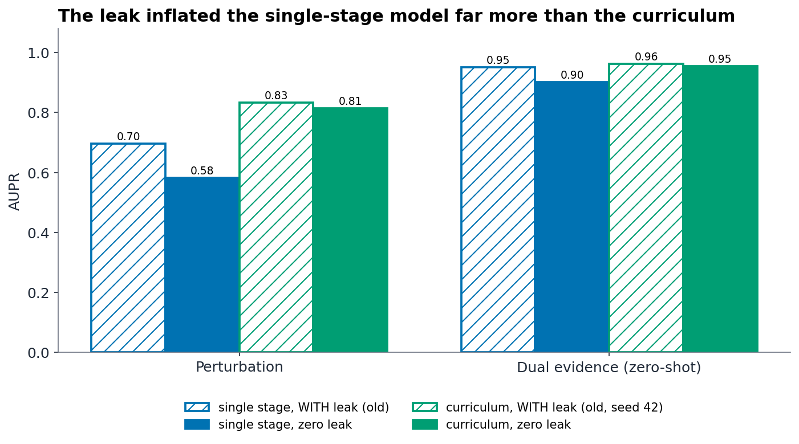
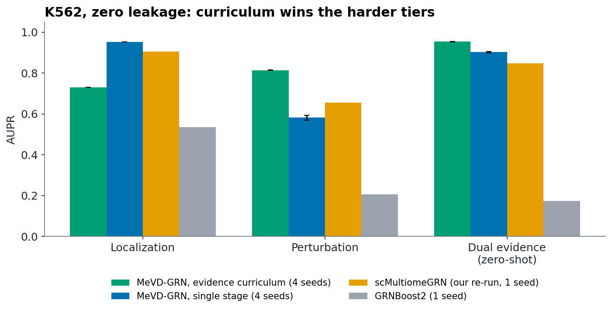
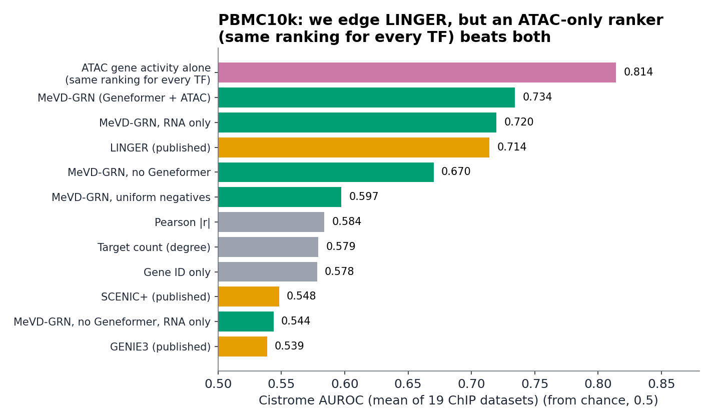
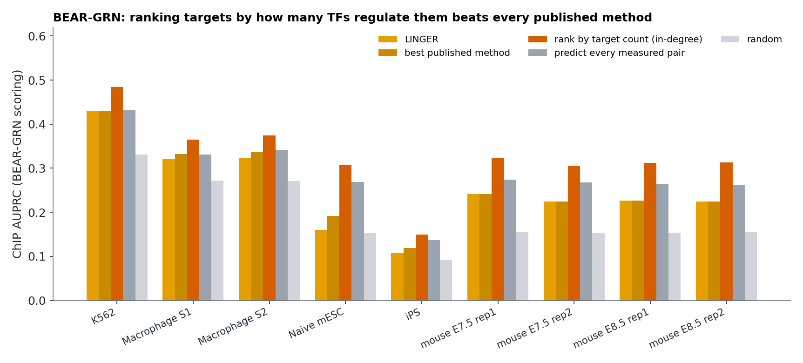
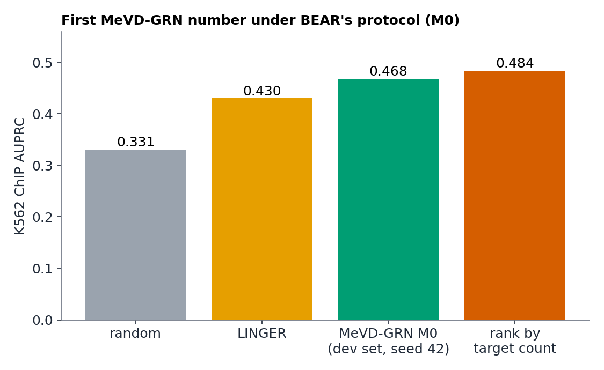

# MeVD-GRN: progress, 27 Sept to 9 Oct 2026

Vishak Kashyap K · advisor meeting, 10 Oct 2026, 11:00
Branch `leak-fix-and-benchmarks` · 20+ commits in this period

> Every model result in this deck is **zero-leakage**: label-free input graphs, no validation/test
> negatives in the training pool, and on external benchmarks the evaluated TFs never seen in training.
> Old leaky numbers appear only where marked, to show what the leak did.
> Data and tables: [advisor_meeting_2026-10-10.md](advisor_meeting_2026-10-10.md). Charts are regenerated by
> [presentation_figs/make_figs.py](presentation_figs/make_figs.py).

---

## 1. Summary

1. **Found and fixed two train/test leaks.** The first inflated our old headline model by 0.12 AUPR on perturbation.
   Training now refuses to run unless both are closed.
2. **With zero leakage, the evidence-tier curriculum beats our re-run of scMultiomeGRN** on the perturbation (+0.16 AUPR)
   and zero-shot dual-evidence (+0.11) tiers of K562. It loses on localization (it forgets the first tier).
3. **Chose the external benchmark by surveying ~130 papers:** 10x PBMC10k Multiome with LINGER's Cistrome evaluation,
   then **BEAR-GRN** (Nat Commun, Sept 2026) as the benchmark to beat.
4. **Both benchmarks reward simple per-gene priors.** Ranking target genes by how many TFs regulate them beats every
   published method on all 9 BEAR-GRN datasets, and an ATAC-only ranker beats MeVD-GRN and LINGER on PBMC10k.
   Any "we beat LINGER" claim has to be made against these baselines too.
5. **MeVD-GRN under BEAR-GRN's protocol:** first number (K562, development set) is above LINGER and below the
   target-count baseline. Model selection and the 9-dataset grid are running.

---

## 2. Where the time went

| Date | What |
|---|---|
| 29 Sept | Repo documentation reorganised and pushed |
| 29-30 Sept | 17 local papers read into a knowledge base; scMultiomeGRN benchmark pipeline built (later set aside) |
| 30 Sept - 1 Oct | **Leak 1 found and fixed**; ~130-paper survey picks the benchmark |
| 1-2 Oct | Ada back after its upgrade; K562 re-runs and PBMC10k grid (220 runs) on Ada; BEAR-GRN pipeline built |
| 2-8 Oct | Ada login blocked (expired password); local work: leak 2 quantified, PBMC diagnosis, paper revision plan |
| 8-9 Oct | **Zero-leak enforced in code**; K562 re-run with both fixes; BEAR-GRN protocol pre-registered; first BEAR-GRN run |

---

## 3. The model, in one picture

- Paired scRNA + scATAC in, a probability for every (TF, gene) pair out.
- Both input graphs are built **without labels**, so the encoders never see a known regulatory edge.
- ATAC gates the score: a gene that is not accessible is unlikely to be a target.
- Training uses evidence tiers: ChIP-seq (TF binds), then knockout (TF changes the gene); the ChIP ∩ knockout tier is
  held out and only used for testing.

---

## 4. Finding the leak

**Leak 1: negatives.** The trainer drew random negative pairs from the whole pool, and the validation/test negatives
were part of that pool. On K562 the model trained on 100% of the negatives it was later scored on. The baselines never
had this problem, so the comparison was tilted in our favour.

**Leak 2: input graph.** The TF-candidate graph was built with every known positive removed, including test positives,
so "this pair is a graph edge" meant "this pair is a negative". Measured: 0 test positives were graph edges, against
2.8-3.0% of test negatives.

**The fix.** Val/test negatives are removed from the pool; graphs are built label-free; a guard blocks any training run
that is not zero-leak, and each result file records its leak status. Leaky settings only run in configs explicitly
flagged as legacy comparisons.

**Check.** With the fix switched off, the rerun reproduces the old numbers to 4 decimals, so the drop comes from the
fix alone.

---

## 5. What the leak did

| K562, AUPR | with leak (old) | zero leak (4-seed mean) |
|---|---|---|
| single stage, perturbation | 0.695 | 0.582 |
| single stage, dual evidence | 0.952 | 0.902 |
| curriculum, perturbation (old: seed 42 only) | 0.833 | 0.814 |
| curriculum, dual evidence (old: seed 42 only) | 0.962 | 0.954 |

- The single-stage model, our old headline, lost 0.11 on perturbation. The curriculum barely moved (-0.02).
- The second leak changed scores by at most about 0.01.
- Why the single-stage model was hit harder is an open question; the first explanation we tried did not match the code.
- The old claim that single-stage "wins all three tiers" was contradicted by our own table, and is corrected.

---

## 6. K562 head-to-head, zero leakage

| AUPR / AUROC, mean of 4 seeds | Localization | Perturbation | Dual evidence (zero-shot) |
|---|---|---|---|
| **MeVD-GRN, curriculum** | 0.730 / 0.751 | **0.814 / 0.960** | **0.954 / 0.990** |
| MeVD-GRN, single stage | **0.953 / 0.947** | 0.582 / 0.883 | 0.902 / 0.979 |
| scMultiomeGRN (our re-run, 1 seed) | 0.906 / 0.914 | 0.655 / 0.919 | 0.847 / 0.971 |
| GRNBoost2 (1 seed) | 0.535 / 0.499 | 0.206 / 0.550 | 0.173 / 0.525 |

- Seed std is at most 0.001 for the curriculum and 0.012 for single stage.
- The curriculum **forgets localization**; fixing that is queued (replay weight, a short refresh stage).
- Caveats: scMultiomeGRN is our re-implementation, one seed, not their released code. We did not run their own benchmark
  (fetal lung), whose labels are motif scans of the same ATAC data used as input.

---

## 7. Choosing the external benchmark

- **Knowledge base:** 17 local papers (datasets, ground truths, numbers to beat).
- **Web survey:** ~130 papers over three searches (high-impact journals, ML venues/preprints, benchmarks and reviews).
- **Consensus:** 10x `pbmc_granulocyte_sorted_10k` Multiome, scored with LINGER's Cistrome ChIP evaluation. It is truly
  paired, used by 17-22 papers (SCENIC+, LINGER, scGLUE, KEGNI, scTFBridge, ...).
- **What reviewers now expect from supervised models:** hold whole TFs out of training, degree-matched negatives, and
  trivial-baseline controls. Random edge splits let simple tricks match GNNs (InfoSEM, ICML 2025; Stock et al. 2025).
- **Then BEAR-GRN** (Nat Commun, 18 Sept 2026) became the benchmark to beat: 9 methods, 9 datasets, 4 ground truths,
  from the group that built SC-MO-GRN-DB. LINGER ranks first overall.

Docs: [benchmark consensus](../reference/multiome_grn_benchmark_consensus.md),
[knowledge base](../reference/literature_knowledge_base.md).

---

## 8. PBMC10k Multiome vs LINGER

Protocol: train on CollecTRI with all 10 evaluation TFs removed, degree-matched negatives, 5 seeds, LINGER's 19 ChIP
datasets, scored over all expressed genes.

| | AUROC | AUPR ratio |
|---|---|---|
| MeVD-GRN (Geneformer + ATAC) | **0.734 ± 0.005** | 2.135 |
| LINGER (published) | 0.714 | **2.253** |
| ATAC gene activity alone, same ranking for every TF | **0.814** | **3.680** |

- ATAC helps a lot **without** Geneformer (+0.126 AUROC), and little with it (+0.015, within noise).
- Degree-matched negatives are essential (0.734 vs 0.597 with uniform ones).
- The ATAC-only ranker beating both methods shows the Cistrome metric rewards a per-gene prior; the 0.734 vs 0.714
  comparison says little about TF-specific signal.
- Provisional: LINGER's published numbers use its own candidate genes, and our re-run of it has not succeeded yet.
  A local rerun of our own configuration also scored lower (0.690) for a reason not yet found.

---

## 9. BEAR-GRN: what the benchmark rewards

- **On every dataset, ranking target genes by how many TFs regulate them (no expression, no ATAC) beats every
  published method, LINGER included** (ChIP AUPRC, BEAR's own scoring).
- Predicting "every measured pair" gets within 0.001 of LINGER on K562.
- On the K562 knockout and intersection ground truths every method, and every baseline, is at or below random.
- Our scoring port reproduces the paper's AUPRC exactly on the released methods we checked.

Reading: BEAR's metric partly measures which genes are hubs. A fair win over LINGER has to beat these baselines too.

---

## 10. MeVD-GRN under BEAR-GRN: pre-registered protocol and first number

**Fixed before any new run:**
- K562 is the development dataset; the other 8 stay untouched until the model is frozen.
- Headline model chosen from four pre-declared candidates (M0-M3: base, uniform negatives, + hub term, + motif
  features) using **validation scores of held-out TFs on K562 only**.
- Train with whole TFs held out (5-fold), dense scoring, every method scored 20 times, and a stated win rule: beat LINGER, the
  target-count baseline, and coverage. LINGER's external ENCODE pretraining is stated as an advantage we do not have.

**M0, K562 ChIP (development set, seed 42):** AUROC 0.602, AUPRC 0.468. Above LINGER (0.536 / 0.430), below the
target-count baseline (0.652 / 0.484). This is a development-set diagnostic, not a held-out result.

---

## 11. Review of the paper, and the novelty audit

Side-by-side study against scMultiomeGRN ([mevd_vs_scmultiomegrn.md](../mevd_vs_scmultiomegrn.md)).

- **Claimable novelty (none is a new architecture block):** the evidence-tier protocol (train on ChIP and knockout,
  test zero-shot on their intersection); the Geneformer finding (helps in-domain, hurts transfer); joint training on two
  cell types with zero-shot transfer; the ATAC-gated decoder, for interpretability.
- **Not novel:** Geneformer embeddings in a GRN GNN (scRegNet), MAESTRO-style ATAC features, separate modality towers,
  replay, hard-negative mining.
- **Found 18 places where the paper and code disagree, plus 5 more errors.** Example: one ablation row mixes the
  localization/perturbation of one run with the dual-evidence of another (0.949 vs the true 0.963).
- **Paper revision plan** with line numbers: [paper_revision_plan.md](../paper_revision_plan.md). The paper is not edited
  yet; the headline model should switch back to the curriculum.

---

## 12. Engineering incidents (so the numbers can be trusted)

| Incident | Effect | Fix |
|---|---|---|
| Ada upgrade; gateway moved | jobs and login scripts broke | new layout documented |
| Expired account password | Ada logins refused for ~a week; finished jobs lost their stage-out | change password; stage-out retries and verifies |
| Laptop suspended itself | killed every local job, twice | `systemd-inhibit` around long jobs |
| Device-mismatch bug in the new training loop | first BEAR-GRN runs crashed at epoch 1 | fixed, smoke-tested on CPU |
| GPU out-of-memory when two queues shared the 8 GB card | PBMC runs crashed | shared memory gate for every GPU job |
| `/share1` file-count quota exceeded | writes would fail | small result files archived |
| LINGER re-run | failed twice (memory, then a missing package) | not yet re-run |

---

## 13. What we can and cannot claim

**Supported**
- Two leaks found, fixed, and now blocked in code.
- On K562, with zero leakage, the curriculum beats our re-run of scMultiomeGRN on perturbation and zero-shot dual evidence.
- Both external benchmarks are partly solved by simple per-gene priors; this affects how any win must be claimed.

**Not yet supported**
- That MeVD-GRN beats LINGER on BEAR-GRN. No held-out result exists yet.
- A PBMC10k win that reflects TF-specific signal.
- Anything on scMultiomeGRN's own benchmark.

---

## 14. Timeline of what is running (laptop GPU; Ada reachable only from campus or VPN)

| Job | ETA |
|---|---|
| BEAR-GRN M0 (K562, base model) | **done** (70 min) |
| M1 (uniform negatives) | ~21:55, 9 Oct |
| M2 (hub term) | ~23:05 |
| M3 (hub + motif features) and model selection | ~00:15-00:45, 10 Oct |
| K562 seed 46, PBMC supplementary runs | after BEAR-GRN selection, early 10 Oct |
| **BEAR-GRN grid:** 5 seeds x 9 datasets, then compendium-only regime and 3 ablations (~150 runs) | **~4-6 days on the laptop; ~1.5-2 days on Ada's 4 GPUs** |

Not planned this week: Jaccard stability (needs a package we lack), LINGER re-run.

---

## 15. Next steps, and questions for you

1. Finish selection (M1-M3), freeze the model, launch the 9-dataset grid on Ada.
2. Hub-controlled analysis: does MeVD-GRN add signal beyond target-count?
3. Fix curriculum forgetting (replay weight, refresh stage); then switch the paper's headline to the curriculum.
4. Rewrite the paper per the revision plan.

**Questions**
- BEAR-GRN's benchmark targets label-free methods. We are supervised with held-out TFs. Is that acceptable, or should we also run a version that never sees BEAR's labels (the compendium-only regime, already planned), or a self-supervised variant (days of work)?
- Given the hub and coverage baselines, how should we frame a win over LINGER?
- Lead the paper with BEAR-GRN, PBMC10k, or K562?

---

*Figure sources: charts by `presentation_figs/make_figs.py` (reads result files); architecture drawn as SVG
(`../figures/make_architecture_simple.py`). BioRender figure generation was attempted and failed because the connector's
authorization expired; the architecture figure can be rebuilt there once it is reconnected.*
